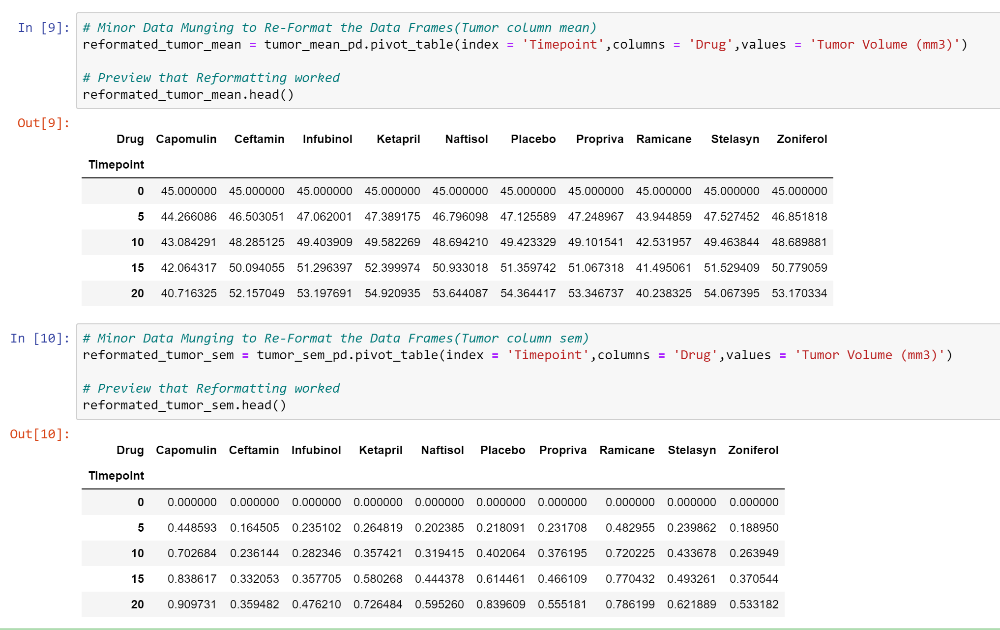

## Overview

A recent animal study was analyzed to compare how 4 different drug treatments affect tumor volume over a 45 day period.

## Languages and Libraries Used

Python on a Jupyter Notebook. Pandas library was used to convert data to a dataframe. Numpy Library was used for some calculations (standard errors, etc.). Matplotlib was used to create visualizations that shows the treatments progress.

## Instructions

* Load the 2 CSV files (Mice_Drug data and Tumor_Volume data) into the Jupyter notebook. Display both files as tables.

* Joined both tables with an outer join.

* Caluculated required mean and standard error.

* Plotted and Visualized results based on Tumor Volume (In MM), Metstatic Sites (Cancer Spreading), Mouse Survival Rate and Tumor Volume change, over the 45 day study period.

* 4 Data trends included after each visualization.

## Screenshots of Final Notebook

